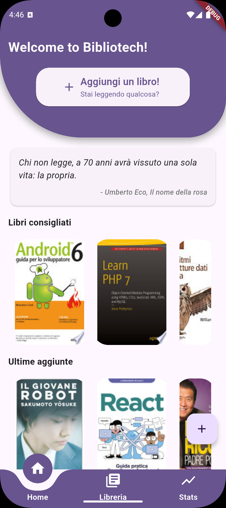
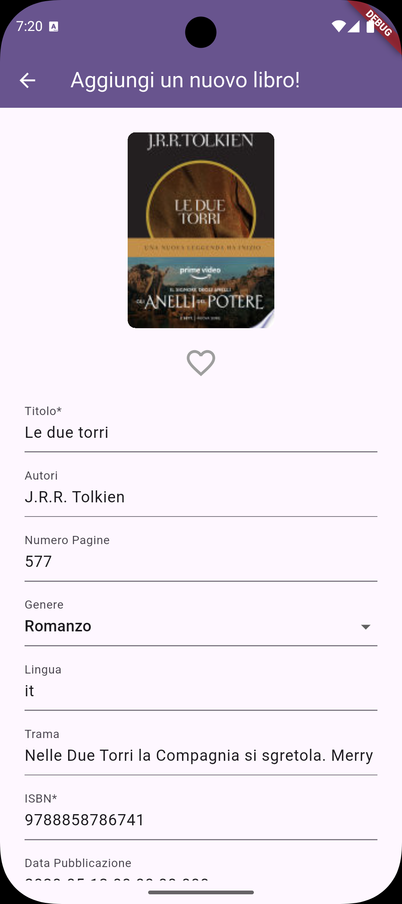
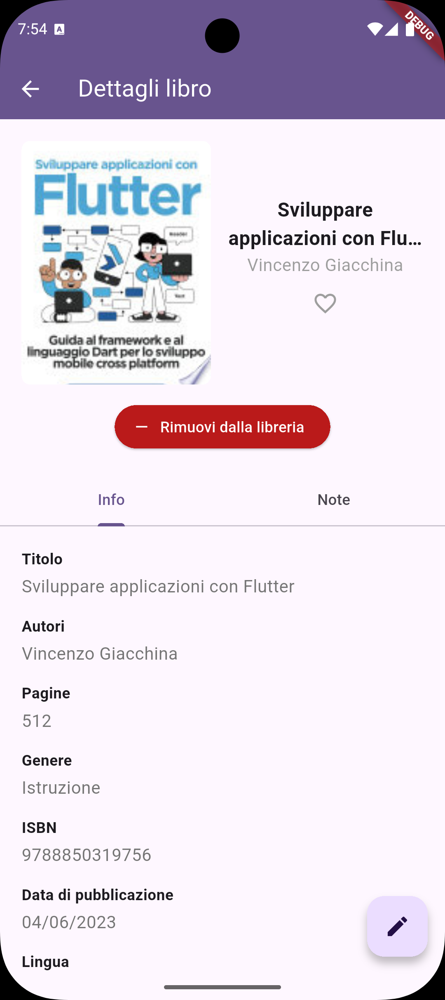

# 📚 Bibliotech

[](https://flutter.dev/)

> **Bibliotech** è un'app mobile multipiattaforma per la gestione della libreria personale.  
> Sviluppata in Flutter, consente di catalogare, arricchire e organizzare i tuoi libri con facilità.

---

## 🚀 Demo & Risorse

- **Documentazione del progetto:** [PDF](docs/RELAZIONE_GRUPPO_17.pdf) o [Overleaf](https://www.overleaf.com/read/ryzhknrbptmc#f3aa6c)
- **Documentazione tecnica:** [Github Actions](https://emanueletocci.github.io/Bibliotech/)
- **Mockup UI:** [Figma](https://www.figma.com/design/QSPCMmoPRzGiIP1bdn78C8/Mobile-Programming?node-id=0-1&t=kzEEztlGSt7d5SN1-1)

---

## ✨ Caratteristiche principali

- 📖 **Gestione libreria**: aggiungi, modifica e organizza i tuoi libri.
- 🔍 **Ricerca e filtri avanzati**: trova rapidamente libri per titolo, genere, stato o preferiti.
- 💬 **Citazioni letterarie**: ogni giorno una nuova citazione per ispirarti.
- 📊 **Statistiche di lettura**: monitora i tuoi progressi e le tue abitudini di lettura.
- 📱 **responsive e multipiattaforma**: interfaccia ottimizzata per dispositivi mobile, compatibile con iOS e Android.


---


## 📦 Come iniziare

```
git clone https://github.com/emanueletocci/Bibliotech.git
cd Bibliotech
flutter pub get
```
Per l'esecuzione locale dell'applicazione é necessario aver installato un emulatore **Android/Ios**. L'applicazione non é compatibile con desktop e browser. Una volta lanciato l'emulatore, é possibile avviare *Bibliotech* con il seguente comando:

```
flutter run
```

Altrimenti, per un'anteprima in modalitá release é possibile utilizzare il seguente comando:

```
flutter run --release
```

Gli utenti **Android** possono installare direttamente l'apk fornito al seguente 

---

## 📱 Anteprima

<p align="center">
  
  
  
  

</p>

